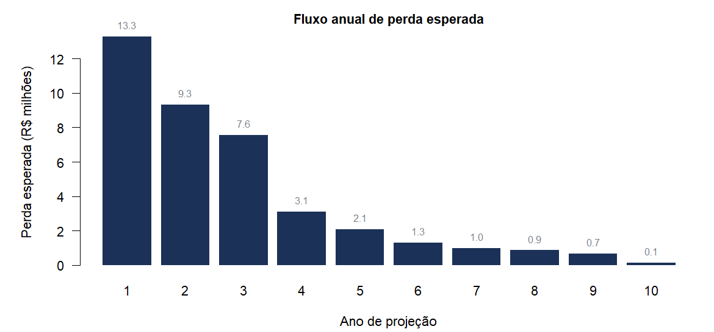
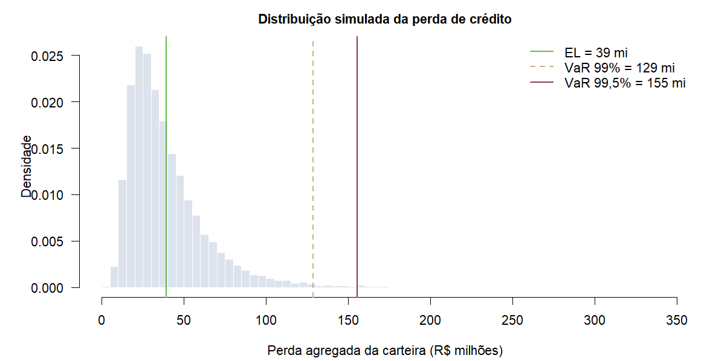
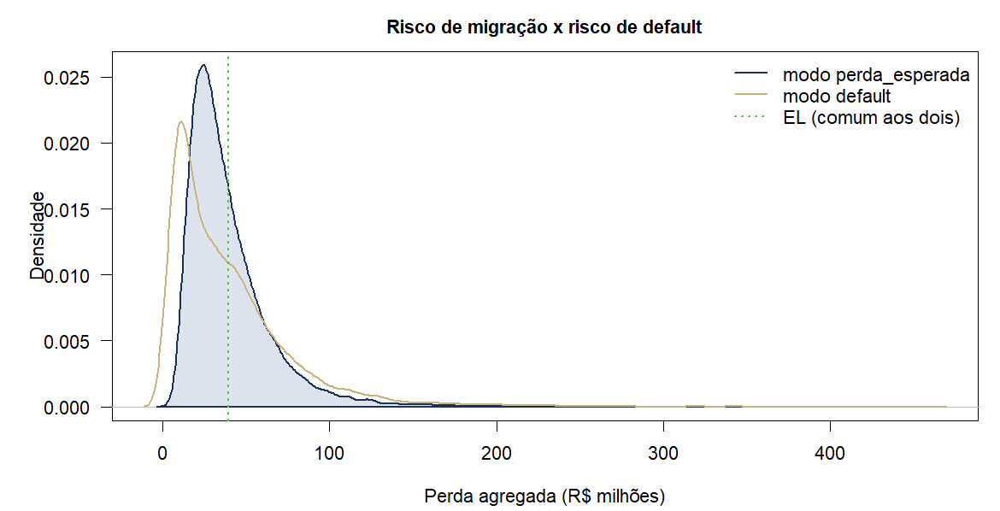
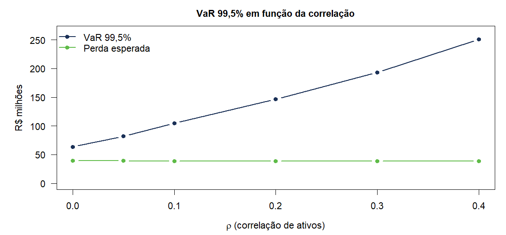

# Cálculo de Risco de Crédito

**VaR e TVaR de crédito por migração de rating multiperíodo**


## Objetivo

Este documento descreve e executa um modelo de **Valor em Risco de Crédito**
para uma carteira de crédito privado. O modelo projeta cada ativo ano a ano até
a sua *duration*, ressorteia o rating de cada ativo em cada período a partir da
matriz de transição, acumula a perda esperada ao longo do caminho percorrido e
usa a distribuição empírica das perdas agregadas para extrair VaR e TVaR — em
particular o percentil **99,5%**, nível usual de capital econômico.

Todo o código está em [`credito.R`](credito.R), sem dependência de pacote
algum. As premissas vêm de fontes públicas e ficam em [`dados/`](dados) como
CSV editável. A carteira usada aqui é **sintética**, gerada aleatoriamente, e
serve apenas para demonstrar que o modelo roda ponta a ponta.

---

## 1. Premissas

### 1.1 Matriz de transição de rating

Migração média anual de rating por letra cheia, emissores corporativos
globais, 1920–2004, publicada pela Moody's.


Table: Matriz de transição publicada (%, com coluna WR)

|rating |   Aaa|    Aa|     A|   Baa|    Ba|     B| Caa-C|     D|    WR|
|:------|-----:|-----:|-----:|-----:|-----:|-----:|-----:|-----:|-----:|
|Aaa    | 88.19|  6.95|  0.79|  0.18|  0.03|  0.00|  0.00|  0.00|  3.86|
|Aa     |  1.28| 85.35|  6.64|  0.72|  0.19|  0.04|  0.00|  0.06|  5.72|
|A      |  0.08|  2.89| 84.96|  5.56|  0.71|  0.14|  0.03|  0.07|  5.55|
|Baa    |  0.05|  0.32|  4.68| 80.69|  5.46|  0.82|  0.15|  0.30|  7.53|
|Ba     |  0.01|  0.09|  0.54|  6.01| 73.61|  7.07|  0.73|  1.31| 10.65|
|B      |  0.00|  0.06|  0.20|  0.75|  6.55| 71.09|  5.74|  4.32| 11.30|
|Caa-C  |  0.00|  0.02|  0.04|  0.16|  0.96|  6.53| 67.30| 14.36| 10.63|

A coluna **WR** (*withdrawn rating* — emissores cujo rating foi retirado antes
do fim do ano) não é um estado de crédito: é censura amostral. O modelo a
remove e redistribui a massa proporcionalmente entre os estados observados,
que é o tratamento padrão. Acrescenta ainda a linha de **D** como estado
absorvente. A matriz efetivamente usada é:


Table: Matriz normalizada (%), D absorvente

|      |       D|  Caa-C|      B|     Ba|    Baa|      A|     Aa|    Aaa|
|:-----|-------:|------:|------:|------:|------:|------:|------:|------:|
|D     | 100.000|  0.000|  0.000|  0.000|  0.000|  0.000|  0.000|  0.000|
|Caa-C |  16.068| 75.305|  7.307|  1.074|  0.179|  0.045|  0.022|  0.000|
|B     |   4.870|  6.471| 80.138|  7.384|  0.845|  0.225|  0.068|  0.000|
|Ba    |   1.466|  0.817|  7.911| 82.365|  6.725|  0.604|  0.101|  0.011|
|Baa   |   0.324|  0.162|  0.887|  5.905| 87.261|  5.061|  0.346|  0.054|
|A     |   0.074|  0.032|  0.148|  0.752|  5.887| 89.962|  3.060|  0.085|
|Aa    |   0.064|  0.000|  0.042|  0.202|  0.764|  7.043| 90.528|  1.358|
|Aaa   |   0.000|  0.000|  0.000|  0.031|  0.187|  0.822|  7.229| 91.731|

### 1.2 Probabilidade de default acumulada

Taxas médias de default acumuladas por rating, ponderadas por emissor,
1920–2004, também da Moody's. O horizonte de **10 anos é o teto do modelo**:
é até onde a curva publicada vai sem extrapolação.


Table: PD acumulada (%) por horizonte, em anos

|      |    1a|    2a|    3a|    4a|    5a|    6a|    7a|    8a|    9a|   10a|
|:-----|-----:|-----:|-----:|-----:|-----:|-----:|-----:|-----:|-----:|-----:|
|Aaa   |  0.00|  0.00|  0.02|  0.09|  0.19|  0.30|  0.41|  0.59|  0.77|  1.01|
|Aa    |  0.06|  0.19|  0.32|  0.49|  0.78|  1.11|  1.48|  1.85|  2.20|  2.57|
|A     |  0.08|  0.25|  0.54|  0.87|  1.22|  1.58|  1.98|  2.34|  2.76|  3.22|
|Baa   |  0.31|  0.93|  1.69|  2.55|  3.40|  4.28|  5.12|  5.95|  6.83|  7.63|
|Ba    |  1.39|  3.36|  5.48|  7.71|  9.93| 12.01| 13.84| 15.65| 17.25| 19.00|
|B     |  4.56|  9.97| 15.24| 19.85| 23.80| 27.13| 30.16| 32.62| 34.74| 36.51|
|Caa-C | 15.07| 24.77| 31.82| 36.76| 40.50| 43.63| 45.85| 47.94| 49.89| 51.64|

Essa curva **não** alimenta a simulação: ela é o *benchmark* determinístico
contra o qual a PD simulada é conferida na seção 5. Quem alimenta a simulação
é a coluna `D` da matriz de transição, que dá a PD de um período de cada
rating:


Table: As duas fontes de PD de um ano concordam

|Rating |PD 1a matriz |PD 1a tabela |
|:------|:------------|:------------|
|Aaa    |0,000%       |0,000%       |
|Aa     |0,064%       |0,060%       |
|A      |0,074%       |0,080%       |
|Baa    |0,324%       |0,310%       |
|Ba     |1,466%       |1,390%       |
|B      |4,870%       |4,560%       |
|Caa-C  |16,068%      |15,070%      |

### 1.3 LGD

Valores supervisórios do IRB fundação de Basileia (BCBS, *Basel III:
Finalising post-crisis reforms*, capítulo CRE32), mapeados por tipo de
instrumento e senioridade. A coluna Moody's é a alternativa empírica: 1 menos
a taxa média de recuperação por classe de senioridade, 1982–2004.


Table: LGD por tipo de ativo

|Ativo                 |Senioridade                              |LGD Basileia |Referência       |LGD Moody's |
|:---------------------|:----------------------------------------|:------------|:----------------|:-----------|
|Debenture             |Senior quirografaria - corporate         |40,0%        |CRE32.6          |55,1%       |
|Debenture Subordinada |Subordinada                              |75,0%        |CRE32.7          |68,0%       |
|Nota Comercial        |Senior quirografaria - corporate         |40,0%        |CRE32.6          |55,1%       |
|Bond                  |Senior quirografaria - corporate         |40,0%        |CRE32.6          |55,1%       |
|Letra Financeira      |Senior quirografaria - banco             |45,0%        |CRE32.6          |55,1%       |
|Letra Financeira Sub  |Subordinada - banco                      |75,0%        |CRE32.7          |68,0%       |
|CRI                   |Garantia de imovel comercial/residencial |20,0%        |CRE32.11         |42,6%       |
|CRA                   |Garantia de recebiveis                   |20,0%        |CRE32.11         |42,6%       |
|FIDC Senior           |Cota senior - recebiveis                 |20,0%        |CRE32.11         |42,6%       |
|FIDC Mezanino         |Cota mezanino                            |60,0%        |CRE32.7 ajustado |60,9%       |
|FIDC Subordinada      |Cota subordinada                         |75,0%        |CRE32.7          |71,1%       |
|Titulo Publico        |Senior quirografaria - soberano          |45,0%        |CRE32.6          |55,1%       |

### 1.4 Correlação de ativos

O sorteio dos cenários usa a correlação de ativos do IRB de Basileia para
exposições corporativas, calculada por ativo a partir da sua PD de um ano:

$$
\rho(PD) = 0{,}12 \cdot \frac{1 - e^{-50 \cdot PD}}{1 - e^{-50}}
         + 0{,}24 \cdot \left(1 - \frac{1 - e^{-50 \cdot PD}}{1 - e^{-50}}\right)
$$


Table: Correlação de ativos por rating

|Rating |PD      |rho   |
|:------|:-------|:-----|
|Aaa    |0,000%  |0,240 |
|Aa     |0,064%  |0,236 |
|A      |0,074%  |0,236 |
|Baa    |0,324%  |0,222 |
|Ba     |1,466%  |0,178 |
|B      |4,870%  |0,131 |
|Caa-C  |16,068% |0,120 |

---

## 2. Estrutura do modelo

### 2.1 Projeção do fluxo até a *duration*

Cada ativo $i$ é projetado em períodos anuais $t = 1, \dots, T_i$, com

$$
T_i = \min\big(\max(1,\ \text{round}(\text{duration}_i)),\ 10\big)
$$

Ativo sem *duration* contratual (0 ou ausente) entra pelo teto de 10 anos —
premissa conservadora. A exposição viva em cada período segue o perfil do
papel: `bullet` mantém o principal até o vencimento, `linear` amortiza em
parcelas iguais.

### 2.2 Sorteio do rating: `risk_discrete`

A cada período o rating é ressorteado a partir da linha da matriz
correspondente ao rating **vigente**, e não ao rating original. O sorteio usa
a representação por limiares do CreditMetrics: para o rating $r$ os estados
são ordenados do pior para o melhor e os limiares no eixo normal padrão são

$$
z_{r,k} = \Phi^{-1}\!\left(\sum_{m \le k} M_{r,m}\right)
$$

O ativo migra para o estado $k$ quando a sua variável latente $X$ cai entre
$z_{r,k-1}$ e $z_{r,k}$. Com $X \sim N(0,1)$ independente, a frequência dos
destinos reproduz exatamente a linha da matriz — o teste 3 da bateria de
validação confere isso célula a célula.

### 2.3 Perda esperada ao longo do caminho

A forma da perda esperada é preservada:

$$
\text{EL}_i = \text{Exposição}_i \cdot \text{PD}_i \cdot \text{LGD}_i
$$

O que muda é a origem da PD. Ela deixa de ser um número lido na tabela pelo
rating inicial e passa a ser a PD acumulada ao longo do caminho de rating
efetivamente sorteado:

$$
\text{PD}_i(\text{caminho}) = 1 - \prod_{t=1}^{T_i}\big(1 - q(R_i(t-1))\big)
$$

onde $q(r)$ é a PD de um período do rating $r$. Isso se decompõe exatamente em
um fluxo anual de perda esperada:

$$
\text{EL}_i = \sum_{t=1}^{T_i} \underbrace{E_i(t) \cdot \text{LGD}_i}_{\text{exposição em risco}}
\cdot \underbrace{S_i(t-1)}_{\text{sobreviveu até } t-1} \cdot \underbrace{q(R_i(t-1))}_{\text{PD do período}}
$$

com $S_i(t) = \prod_{s \le t}(1 - q(R_i(s-1)))$. A soma do fluxo reproduz a EL
total do ativo por telescopagem — a bateria de validação confere essa
identidade numericamente, cenário a cenário.

A perda do portfólio em cada cenário é $L = \sum_i \text{EL}_i$.

### 2.4 Geração dos cenários e o fator sistêmico

Sortear cada ativo de forma independente esvazia a cauda: pela lei dos grandes
números o percentil 99,5% de uma carteira com centenas de papéis fica colado na
média, e o número perde sentido econômico. O modelo introduz um **fator
sistêmico** comum, no formato de cópula gaussiana de um fator:

$$
X_{i,t} = \sqrt{\rho_i}\, Z_t + \sqrt{1 - \rho_i}\, \varepsilon_{i,t},
\qquad Z_t, \varepsilon_{i,t} \sim N(0,1)
$$

$Z_t$ é o mesmo para todos os ativos naquele período e cenário: é o ano ruim.
$\rho = 0$ devolve exatamente o sorteio multinomial independente. Condicional a
$Z_t$, a PD do período vira

$$
q(r \mid Z_t) = \Phi\!\left(\frac{z_{r,1} - \sqrt{\rho}\,Z_t}{\sqrt{1-\rho}}\right)
$$

que é a mesma fórmula da PD condicional do IRB de Basileia. A distribuição
marginal do rating de destino continua sendo a linha da matriz, então
introduzir correlação **muda a cauda sem mexer na perda esperada** — o teste 8
verifica as duas coisas.

### 2.5 Os dois modos, e por que a média é a mesma

`modo = "perda_esperada"` (padrão) sorteia a migração da matriz **condicional à
sobrevivência** e contabiliza a inadimplência pelo valor esperado, via
$q(\cdot)$. O ativo nunca "pula" para D: ele acumula EL período a período.

`modo = "default"` sorteia da matriz **completa**, com D absorvente. Quando o
caminho entra em D o ativo perde $E \cdot \text{LGD}$ naquele período. É o
default-mode clássico.

Os dois não são alternativas soltas. Escrevendo $\tilde M$ para a matriz
condicional à sobrevivência,
$\prod_t M_{R_{t-1},R_t} = \prod_t \tilde M_{R_{t-1},R_t}\,(1 - q_{R_{t-1}})$,
logo

$$
\mathbb{E}_{\tilde M}\big[\text{PD}(\text{caminho})\big]
= 1 - P(\text{sobreviver até } T)
= P(\text{default até } T)
= \mathbb{E}\big[\mathbf{1}\{\text{default}\}\big]
$$

A perda esperada é **idêntica** nos dois modos. O modo `perda_esperada` é a
versão Rao-Blackwellizada do modo `default`: mesma média, variância menor,
porque integra analiticamente o ruído idiossincrático do evento de default e
deixa na distribuição apenas o risco de **migração**. A seção 5 mostra as duas
distribuições lado a lado.

---

## 3. A carteira


Carteira sintética de 250 ativos, exposição total de
**R$ 4.526.222.983**, *duration* média de
3,7 anos (ponderada pela
posição).


Table: Composição por rating

|Rating |Posição          |% da carteira |
|:------|:----------------|:-------------|
|A      |R$ 1.734.063.909 |38,3%         |
|Aa     |R$ 1.051.251.952 |23,2%         |
|Baa    |R$ 1.011.555.563 |22,3%         |
|Ba     |R$ 366.015.082   |8,1%          |
|B      |R$ 190.165.582   |4,2%          |
|Aaa    |R$ 108.321.469   |2,4%          |
|Caa-C  |R$ 64.849.424    |1,4%          |


Table: Composição por tipo de ativo

|Ativo                 |Posição          |% da carteira |
|:---------------------|:----------------|:-------------|
|Debenture             |R$ 1.048.834.437 |23,2%         |
|Letra Financeira      |R$ 770.264.013   |17,0%         |
|Bond                  |R$ 392.053.059   |8,7%          |
|CRI                   |R$ 375.114.702   |8,3%          |
|FIDC Senior           |R$ 372.955.727   |8,2%          |
|Debenture Subordinada |R$ 370.656.601   |8,2%          |
|CRA                   |R$ 336.773.378   |7,4%          |
|FIDC Subordinada      |R$ 287.590.529   |6,4%          |
|FIDC Mezanino         |R$ 282.587.267   |6,2%          |
|Nota Comercial        |R$ 192.032.539   |4,2%          |
|Letra Financeira Sub  |R$ 97.360.730    |2,2%          |

---

## 4. Resultados

### 4.1 Fluxo de perda esperada

Decomposição da perda esperada por ano de projeção. O perfil decrescente vem
de duas forças: a carteira vai vencendo (menos exposição viva) e os ativos que
sobrevivem já pagaram parte do seu risco.




Table: Perda esperada por ano de projeção

| Ano|EL do ano     |% do total |Acumulado |
|---:|:-------------|:----------|:---------|
|   1|R$ 13.280.735 |33,7%      |33,7%     |
|   2|R$ 9.320.062  |23,7%      |57,4%     |
|   3|R$ 7.565.754  |19,2%      |76,6%     |
|   4|R$ 3.109.357  |7,9%       |84,5%     |
|   5|R$ 2.087.060  |5,3%       |89,8%     |
|   6|R$ 1.318.678  |3,3%       |93,2%     |
|   7|R$ 999.728    |2,5%       |95,7%     |
|   8|R$ 867.230    |2,2%       |97,9%     |
|   9|R$ 677.808    |1,7%       |99,6%     |
|  10|R$ 143.111    |0,4%       |100,0%    |

### 4.2 Distribuição das perdas e VaR

20.000 cenários. Cada cenário é uma trajetória
completa de ratings para toda a carteira, ano a ano, até o vencimento de cada
papel. A distribuição abaixo é a das perdas agregadas; VaR e TVaR saem
diretamente dela, por ordenação — **sem ajuste de distribuição teórica no
meio do caminho**.





Table: Métricas de risco

|Nível |VaR            |TVaR           |Capital (VaR − EL) |VaR / exposição |
|:-----|:--------------|:--------------|:------------------|:---------------|
|95,0% |R$ 85.648.731  |R$ 114.176.369 |R$ 46.279.208      |1,892%          |
|99,0% |R$ 128.733.853 |R$ 163.936.990 |R$ 89.364.330      |2,844%          |
|99,5% |R$ 155.293.694 |R$ 187.122.081 |R$ 115.924.171     |3,431%          |

- **Perda esperada (EL):** R$ 39.369.523 — 0,870% da exposição
- **VaR 99,5%:** R$ 155.293.694 — 3,431% da exposição
- **TVaR 99,5%:** R$ 187.122.081
- **Capital econômico** (perda inesperada, VaR 99,5% − EL): R$ 115.924.171

### 4.3 Faixas de apetite ao risco

As faixas saem direto dos percentis da distribuição simulada, expressas como
percentual da exposição para que o limite não precise ser reeditado a cada
mudança no tamanho da carteira.


Table: Faixas de apetite, em % da exposição de crédito

|Faixa           |Limite inferior |Limite superior |Percentil      |Leitura                    |
|:---------------|:---------------|:---------------|:--------------|:--------------------------|
|Verde           |0,000%          |1,079%          |até p75        |Dentro do esperado         |
|Amarelo         |1,079%          |1,532%          |p75 a p90      |Monitorar                  |
|Laranja         |1,532%          |1,892%          |p90 a p95      |Atenção                    |
|Vermelho        |1,892%          |3,431%          |p95 a p99,5    |Alto risco — ação imediata |
|Fora do apetite |3,431%          |—               |acima do p99,5 |Excede o apetite           |

### 4.4 Concentração

Contribuição para a perda esperada, por rating e por tipo de ativo. É onde se
vê que a EL não segue a exposição: papéis de rating pior e LGD alta pesam
muito mais do que a sua fatia da carteira.


Table: Contribuição para a perda esperada, por rating

|Rating |% da exposição |% da EL |EL            |
|:------|:--------------|:-------|:-------------|
|B      |4,2%           |25,9%   |R$ 10.177.252 |
|Caa-C  |1,4%           |23,2%   |R$ 9.133.305  |
|Ba     |8,1%           |21,3%   |R$ 8.367.358  |
|Baa    |22,3%          |17,4%   |R$ 6.848.959  |
|A      |38,3%          |8,6%    |R$ 3.403.803  |
|Aa     |23,2%          |3,6%    |R$ 1.431.318  |
|Aaa    |2,4%           |0,0%    |R$ 7.529      |


Table: Dez maiores contribuições individuais para a EL

|Ativo   |Tipo                  |Rating | Prazo|LGD |Posição        |EL           |
|:-------|:---------------------|:------|-----:|:---|:--------------|:------------|
|ATV0147 |Debenture             |B      |     3|40% |R$ 81.746.638  |R$ 4.873.238 |
|ATV0114 |Letra Financeira      |CCC    |     9|45% |R$ 12.399.781  |R$ 3.774.068 |
|ATV0173 |Letra Financeira      |CCC    |     1|45% |R$ 41.537.591  |R$ 2.993.754 |
|ATV0220 |Debenture Subordinada |BB-    |     3|75% |R$ 51.781.984  |R$ 2.022.380 |
|ATV0044 |Letra Financeira Sub  |BBB+   |     9|75% |R$ 38.399.156  |R$ 1.958.013 |
|ATV0230 |Debenture             |BB+    |     4|40% |R$ 51.980.721  |R$ 1.516.750 |
|ATV0224 |FIDC Subordinada      |B      |     2|75% |R$ 26.865.617  |R$ 1.493.053 |
|ATV0126 |Letra Financeira      |CCC    |     4|45% |R$ 6.970.752   |R$ 1.442.785 |
|ATV0047 |FIDC Mezanino         |BBB-   |     3|60% |R$ 240.244.146 |R$ 1.174.728 |
|ATV0235 |Letra Financeira Sub  |BB     |     3|75% |R$ 27.664.678  |R$ 1.084.527 |

---

## 5. Validação

### 5.1 Bateria de testes

```
Rscript tests/regressao.R
```

[`tests/regressao.R`](tests/regressao.R) roda 55 verificações. As que de fato
prendem o modelo:

| # | O que verifica | Por que importa |
|---|---|---|
| 3 | 200 mil sorteios por rating reproduzem a linha da matriz, célula a célula, dentro de 4 desvios binomiais | prova que `risk_discrete` amostra a distribuição certa |
| 4 | com $\rho = 0{,}24$ e $Z$ integrado, a marginal continua sendo a mesma linha | prova que a correlação não distorce a média |
| 6 | a soma do fluxo anual é igual à perda do cenário, ao centavo | prova a identidade de telescopagem da seção 2.3 |
| 7 | $\mathbb{E}[\text{perda}]$ dos dois modos coincide dentro de 3 erros-padrão | prova a equivalência da seção 2.5 |
| 8 | a EL independe de $\rho$, mas o VaR 99,5% cresce com $\rho$ | separa risco médio de risco de cauda |
| 11 | a PD simulada de 1 ano fica a menos de 15% da curva publicada | amarra a simulação à fonte externa |

### 5.2 Os dois modos, lado a lado


Table: Comparação entre os dois modos

|Métrica        |perda_esperada |default        |
|:--------------|:--------------|:--------------|
|Perda esperada |R$ 39.369.523  |R$ 39.529.978  |
|Desvio-padrão  |R$ 24.936.066  |R$ 36.780.501  |
|VaR 99%        |R$ 128.733.853 |R$ 178.157.974 |
|VaR 99,5%      |R$ 155.293.694 |R$ 212.384.503 |
|TVaR 99,5%     |R$ 187.122.081 |R$ 261.861.698 |

A diferença entre as duas perdas esperadas é de
**0,41%**,
contra um erro-padrão de Monte Carlo de
0,80% — ou seja, indistinguível de
zero, como a teoria exige. Já o desvio-padrão do modo `default` é
1,5× o do modo
`perda_esperada`: é o ruído idiossincrático do evento de default, que o modo
padrão integra analiticamente.



### 5.3 Sensibilidade à correlação


Table: Efeito da correlação de ativos sobre a cauda

|ρ                    |EL            |VaR 99,5%      |VaR / EL |
|:--------------------|:-------------|:--------------|:--------|
|0,00                 |R$ 39.333.882 |R$ 63.515.383  |1,61×    |
|0,05                 |R$ 39.157.344 |R$ 81.935.169  |2,09×    |
|0,10                 |R$ 39.033.042 |R$ 104.993.262 |2,69×    |
|0,20                 |R$ 38.890.896 |R$ 146.763.849 |3,77×    |
|0,30                 |R$ 38.703.802 |R$ 193.484.125 |5,00×    |
|0,40                 |R$ 38.520.629 |R$ 251.010.673 |6,52×    |
|Basileia (por ativo) |R$ 39.369.523 |R$ 155.293.694 |3,94×    |



A perda esperada é plana em $\rho$, como tem de ser. O VaR 99,5% sobe de
R$ 63.515.383 sem correlação para R$ 251.010.673
com $\rho = 0{,}40$. **Este é o parâmetro mais sensível do modelo** e o que
mais merece discussão no comitê: ele sozinho move o capital econômico por um
fator de 4,0×.

### 5.4 PD simulada contra a curva publicada

Um ativo por rating, simulado isoladamente sem correlação, comparado com a
curva de PD acumulada da Moody's.


Table: PD acumulada: cadeia de Markov simulada x curva de coortes publicada

|Rating |1a sim |1a Moody's |5a sim |5a Moody's |10a sim |10a Moody's |
|:------|:------|:----------|:------|:----------|:-------|:-----------|
|Aa     |0,06%  |0,06%      |0,43%  |0,78%      |1,34%   |2,57%       |
|A      |0,07%  |0,08%      |0,80%  |1,22%      |2,83%   |3,22%       |
|Baa    |0,32%  |0,31%      |2,77%  |3,40%      |7,93%   |7,63%       |
|Ba     |1,47%  |1,39%      |9,61%  |9,93%      |21,12%  |19,00%      |
|B      |4,87%  |4,56%      |24,22% |23,80%     |42,15%  |36,51%      |
|Caa-C  |16,07% |15,07%     |52,33% |40,50%     |70,10%  |51,64%      |

Em **1 ano** as duas concordam dentro de alguns por cento — é o mesmo número,
vindo das duas tabelas. Em **10 anos** elas divergem, e sistematicamente: a
cadeia subestima o default do grau de investimento alto e superestima o do
grau especulativo. Isso não é bug, é o limite da hipótese markoviana — ver a
seção 6.

---

## 6. Limitações

1. **A matriz de um ano não descreve a dinâmica de longo prazo dos ratings.**
   Elevar a matriz anual à décima potência não reproduz a curva de default de
   10 anos observada (seção 5.4). A migração real tem memória: emissor
   recém-rebaixado tende a ser rebaixado de novo, e o grau especulativo tem
   sobrevivência maior do que a cadeia prevê. Para horizontes longos, calibrar
   contra a matriz de 10 anos publicada, ou aplicar um fator de ajuste por
   rating, é o passo natural.

2. **A correlação é o parâmetro dominante e é uma premissa, não uma medição.**
   A fórmula do IRB foi calibrada para carteiras bancárias de crédito
   corporativo em economias desenvolvidas. Aplicada a crédito privado
   brasileiro ela é uma âncora regulatória, não uma estimativa. A seção 5.3
   mostra a sensibilidade.

3. **LGD é determinística.** O modelo usa LGD fixa por tipo de ativo. Na
   prática a recuperação cai justamente nos anos em que os defaults se
   acumulam — a correlação PD-LGD engorda a cauda e o modelo não a captura.
   Sortear a LGD de uma Beta com média dependente de $Z_t$ seria a extensão.

4. **Não há risco de spread.** O modelo mede perda por inadimplência e
   migração, não marcação a mercado. Um rebaixamento que não vira default gera
   perda contábil por reprecificação que não aparece aqui.

5. **As premissas são globais.** Matriz, curva de PD e LGD vêm de emissores
   corporativos globais e de valores supervisórios de Basileia. Substituir
   pelos CSVs em [`dados/`](dados) por parâmetros locais é operação de editar
   arquivo — nenhuma linha de código muda.

6. **Sem estrutura temporal de exposição além de bullet/linear.** Fluxos de
   caixa reais (cupons, amortizações irregulares) exigiriam a matriz de
   exposição vinda da carteira, e não do perfil.

---

## 7. Como reproduzir

```r
source("credito.R")
prem     <- ler_premissas("dados")
carteira <- carteira_aleatoria(n = 250, seed = 42)   # ou a sua carteira

sim <- simular_carteira(carteira, prem, n_cen = 20000, seed = 2024)
metricas_risco(sim$perdas, niveis = c(0.95, 0.99, 0.995),
               exposicao = sim$exposicao)
```

Para usar uma carteira real, monte um `data.frame` com as colunas `ativo`,
`rating`, `duration` e `posicao` — opcionalmente `id`, `lgd` e `perfil`. Os
ratings são traduzidos pela tabela de equivalência em
[`dados/equivalencia_ratings.csv`](dados/equivalencia_ratings.csv).

---

## Fontes

- **Matriz de transição e PD acumulada:** Moody's Investors Service, *Default
  and Recovery Rates of Corporate Bond Issuers, 1920–2004* (Special Comment,
  janeiro de 2005), Exhibits 17 e 31. Também Exhibit 27 para as taxas médias
  de recuperação por senioridade.
- **LGD supervisória e correlação de ativos:** Basel Committee on Banking
  Supervision, *Basel III: Finalising post-crisis reforms* (BCBS d424,
  dezembro de 2017), capítulos CRE31 e CRE32.

Os valores estão transcritos em [`dados/`](dados) para serem substituídos pelo
relatório vigente sem tocar no código.

*Gerado em 30/08/2026 com R 4.2.3, 20.000 cenários.*
